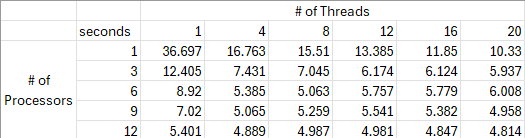

# System Programming Lab 11 Multiprocessing
Multiprocessing implementation is similar to our ICA9 12 core implementation.
It will loop for the 50 desired frames creating a new child when there aren't the designated amount running.
Each child will calculate its name and scale amount then call the mandel executable with those parameters inputted.
The results show that runtime halves until it processes start colliding with other processes on the machine.
When they start colliding, there is minimal time saving

#
# Lab 12
The compute image function instead of always making all lines of the image will calculate the amount of lines each thread needs to produce based on amount inputted.
Threads are passed all of the same variables as compute image and adds two for the starting row and ending row. The struct of inputs is stored in a list to avoid threads getting the wrong data if it is overwritten while new variables are being made.
Another list also stores all the threads so they can be joined in a loop later.

Data shows that it is not necessarily better to have more threads and processes in all cases. If you multiply threads and processes, the sweet spot is around 32-36, until it gets to about 144 and the time continues to drop again. It can be concluded though that in this program, it is better to run more processes than more threads.